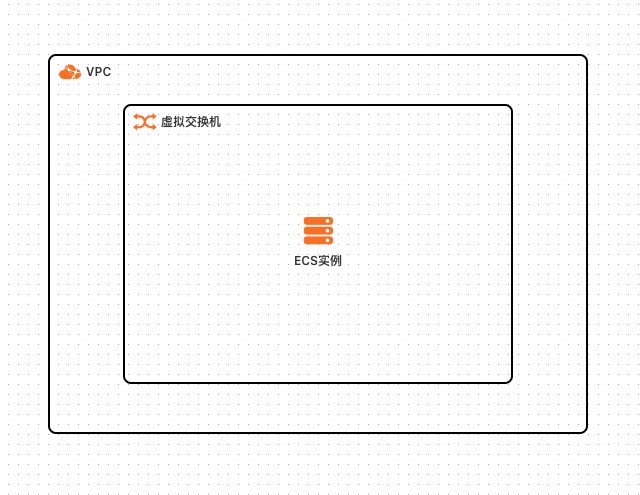
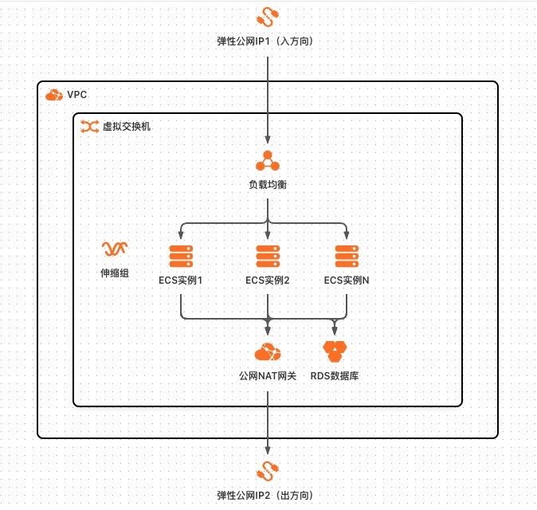
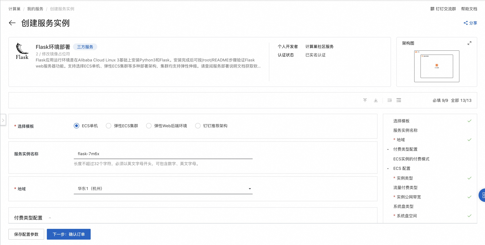
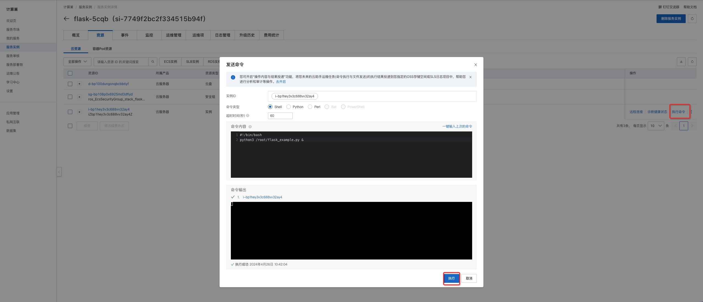

# Flask环境部署

## 概述

Flask应用运行环境是在Alibaba Cloud Linux 3基础上安装Python3和Flask。支持选择ECS单机、弹性ECS集群等多种部署架构，集群均支持弹性伸缩。

## 前提条件

当您的账号是RAM账号时，需要对部分阿里云资源进行访问和创建操作，因此您的账号需要包含如下权限:

  | 权限策略名称                          | 备注                         |
  |---------------------------------|----------------------------|
  | AliyunECSFullAccess             | 管理云服务器服务（ECS）的权限           |
  | AliyunVPCFullAccess             | 管理专有网络（VPC）的权限             |
  | AliyunROSFullAccess             | 管理资源编排服务（ROS）的权限           |
  | AliyunComputeNestUserFullAccess | 管理计算巢服务（ComputeNest）的用户侧权限 |
  | AliyunESSFullAccess             | 管理弹性伸缩服务（ESS）的权限           |
  | AliyunRDSFullAccess             | 管理云数据库服务（RDS）的权限           |

## 部署架构

### ECS单机


### 弹性ECS集群


### 弹性Web后端环境


### 钉钉推荐架构


## 部署流程

单击[部署链接](https://computenest.console.aliyun.com/service/instance/create/cn-hangzhou?type=user&ServiceId=service-6c3765ffac974626812b)
，按界面提示填写参数后创建服务实例。


## 结果验证
等待服务实例部署成功后。进入服务实例详情页，在资源栏中找到ECS并执行命令：

```shell
python3 /root/flask_example.py &
```




执行成功后访问 http://<公网IP地址> 会返回 Hello World