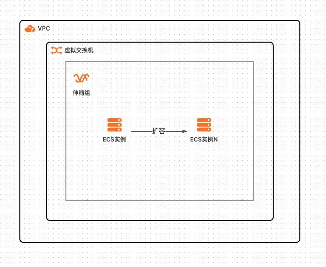
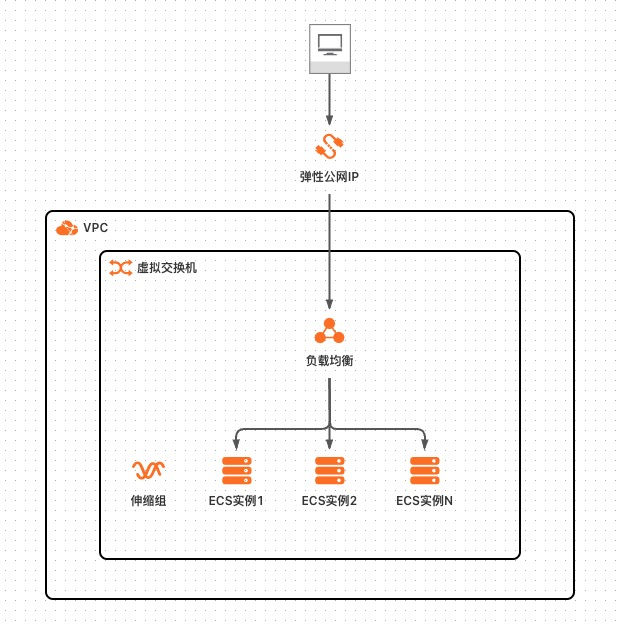
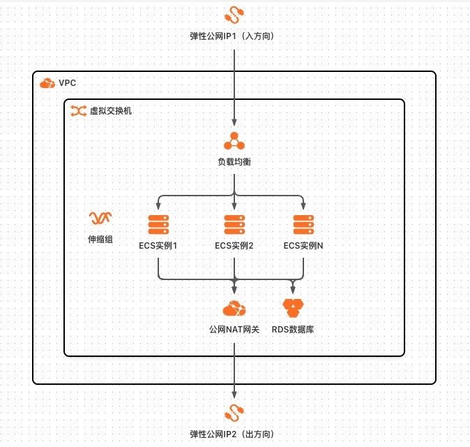
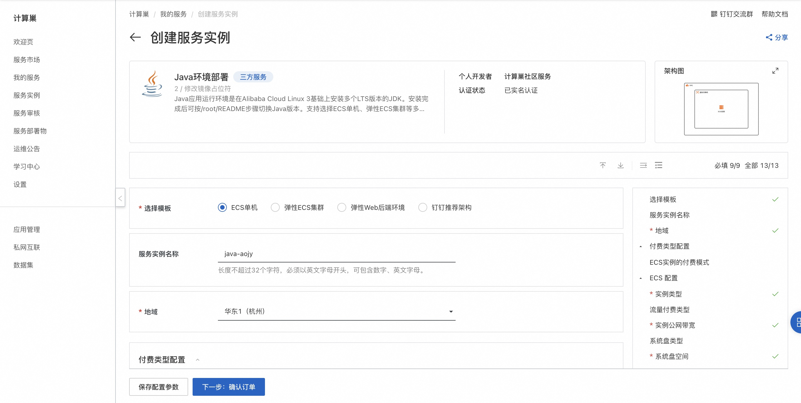

# Flask环境部署

## 概述

Java应用运行环境是在Alibaba Cloud Linux
3基础上安装多个LTS版本的JDK。支持选择ECS单机、弹性ECS集群等多种部署架构，集群均支持弹性伸缩

## 前提条件

当您的账号是RAM账号时，需要对部分阿里云资源进行访问和创建操作。因此您的账号需要包含如下资源的权限。

| 权限策略名称                          | 备注                         |
  |---------------------------------|----------------------------|
| AliyunECSFullAccess             | 管理云服务器服务（ECS）的权限           |
| AliyunVPCFullAccess             | 管理专有网络（VPC）的权限             |
| AliyunROSFullAccess             | 管理资源编排服务（ROS）的权限           |
| AliyunComputeNestUserFullAccess | 管理计算巢服务（ComputeNest）的用户侧权限 |
| AliyunESSFullAccess             | 管理弹性伸缩服务（ESS）的权限           |
| AliyunRDSFullAccess             | 管理云数据库服务（RDS）的权限           |

## 部署架构

### ECS单机


参数详情：

| 参数组   | 参数项        | 示例           | 说明              |
|-------|------------|--------------|-----------------|
| ECS配置 | 付费类型       | 按量付费 或 包年包月  |
| ECS配置 | 实例类型       | ecs.g6.large | 实例规格，可以根据实际需求选择 |
| ECS配置 | 流量付费类型     | 按使用流量        | 实例规格，可以根据实际需求选择 |
| ECS配置 | 实例公网带宽     | 10M          | 出公网最大带宽         |
| ECS配置 | 系统盘类型      | cloud_essd   |                 |
| ECS配置 | 系统盘大小      | 120GB        |                 |
| ECS配置 | 实例密码       |              | 登录密码            |
| 可用区配置 | 可用区        | 杭州可用区K       |                 |
| 网络配置  | 现有VPC的实例ID | vpc-xxx      |                 |
| 网络配置  | 现有网络交换机ID  | vsw-xxx      |                 |

### 弹性ECS集群



参数详情：

| 参数组   | 参数项        | 示例           | 说明              |
|-------|------------|--------------|-----------------|
| ECS配置 | 付费类型       | 按量付费 或 包年包月  |                 |
| ECS配置 | 实例类型       | ecs.g6.large | 实例规格，可以根据实际需求选择 |
| ECS配置 | 系统盘类型      | cloud_essd   |                 |
| ECS配置 | 系统盘大小      | 120GB        |                 |
| ECS配置 | 实例密码       |              | 登录密码            |
| ECS配置 | 实例数量       | 3            | 创建初始ECS实例的数量    |
| 可用区配置 | 可用区        | 杭州可用区K       |                 |
| 网络配置  | 现有VPC的实例ID | vpc-xxx      |                 |
| 网络配置  | 现有网络交换机ID  | vsw-xxx      |                 |

### 弹性Web后端环境



参数详情：

| 参数组   | 参数项        | 示例           | 说明                  |
|-------|------------|--------------|---------------------|
| ECS配置 | 付费类型       | 按量付费 或 包年包月  |                     |
| ECS配置 | 实例类型       | ecs.g6.large | 实例规格，可以根据实际需求选择     |
| ECS配置 | 系统盘类型      | cloud_essd   |                     |
| ECS配置 | 系统盘大小      | 120GB        |                     |
| ECS配置 | 实例密码       |              | 登录密码                |
| ECS配置 | 实例数量       | 1            | 创建初始ECS实例的数量        |
| SLB配置 | 规格         | slb.s1.small | 负载均衡实例规格，可以根据实际需求选择 |
| SLB配置 | 负载均衡公网带宽   | 10Mbps       | 负载均衡绑定的弹性公网IP的最大带宽  |
| 可用区配置 | 可用区        | 杭州可用区K       |                     |
| 网络配置  | 现有VPC的实例ID | vpc-xxx      |                     |
| 网络配置  | 现有网络交换机ID  | vsw-xxx      |                     |

### 钉钉推荐架构



参数详情：

| 参数组   | 参数项        | 示例          | 说明                           |
|-------|------------|-------------|------------------------------|
| ECS配置 | 付费类型       | 按量付费 或 包年包月 |                              |
| ECS配置 | 套餐类型       | 基础版         | 套餐规格（基础版、升级版、高配版），可以根据实际需求选择 |
| ECS配置 | 实例密码       |             | 登录密码                         |
| SLB配置 | 负载均衡后端端口   | 80          | 负载均衡后端端口                     | 
| RDS配置 | 数据库账号名称    | dbname      |                              | 
| RDS配置 | 数据库密码      |             | 数据库密码                        | 
| 可用区配置 | 可用区        | 杭州可用区K      |                              |
| 网络配置  | 现有VPC的实例ID | vpc-xxx     |                              |
| 网络配置  | 现有网络交换机ID  | vsw-xxx     |                              |

## 部署流程

单击[部署链接](https://computenest.console.aliyun.com/service/instance/create/cn-hangzhou?type=user&ServiceId=service-8d2936fa177f46729575)
，按界面提示填写参数后创建服务实例。


## 结果验证

等待服务实例部署成功后。进入服务实例详情页，在资源栏中找到ECS并执行命令：


默认为Java版本为1.8版本：

查看所有Java版本：

```shell
alternatives --list | grep java
```

切换默认Java版本：

```shell
sudo alternatives --config java
```

切换默认Javac版本：

```shell
sudo alternatives --config javac
```
  