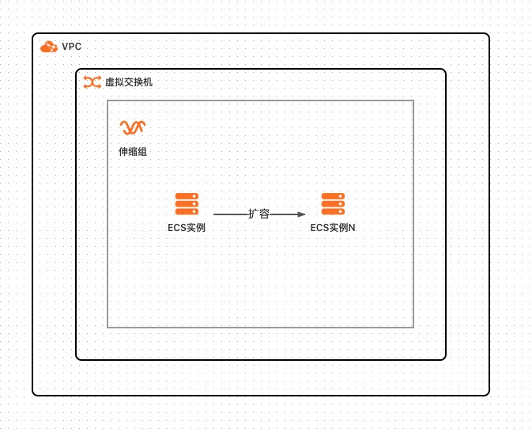

# Flask环境部署

## 概述

LNMP应用运行环境是在Alibaba Cloud Linux 3基础上Nginx/MariaDB（MySQL开源替代）/PHP软件栈并配置系统服务。默认不启动数据库服务。支持选择ECS单机、弹性ECS集群等多种部署架构，集群均支持弹性伸缩。

## 前提条件

当您的账号是RAM账号时，需要对部分阿里云资源进行访问和创建操作。因此您的账号需要包含如下资源的权限。

  | 权限策略名称                          | 备注                         |
  |---------------------------------|----------------------------|
  | AliyunECSFullAccess             | 管理云服务器服务（ECS）的权限           |
  | AliyunVPCFullAccess             | 管理专有网络（VPC）的权限             |
  | AliyunROSFullAccess             | 管理资源编排服务（ROS）的权限           |
  | AliyunComputeNestUserFullAccess | 管理计算巢服务（ComputeNest）的用户侧权限 |
  | AliyunESSFullAccess             | 管理弹性伸缩服务（ESS）的权限           |
  | AliyunRDSFullAccess             | 管理云数据库服务（RDS）的权限           |

## 部署架构

### ECS单机

### 弹性ECS集群

### 弹性Web后端环境

### 钉钉推荐架构

## 部署流程

单击[部署链接](https://computenest.console.aliyun.com/service/instance/create/cn-hangzhou?type=user&ServiceId=service-e6cf8f4f4f754b1e81dc)
，按界面提示填写参数后创建服务实例。

## 结果验证
此应用模板部署了LNMP软件栈，即Linux/Nginx/MariaDB(MySQL的开源替代)/PHP，默认不启动MariaDB

部署完成后，您可以访问 http://<公网IP>/test.php 来验证WEB服务器功能：

如需测试数据库，可以运行/root/setup_test_db.sh后，访问http://<IP>/test_db.php看是否成功连接数据库
注意验证完成后应该将测试数据库（数据库名：test）删除，并修改数据库管理员密码

