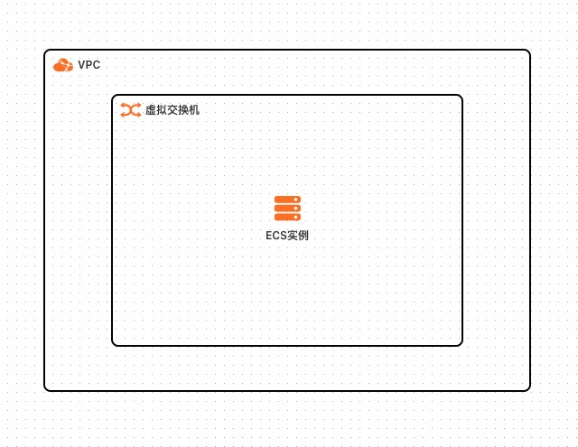
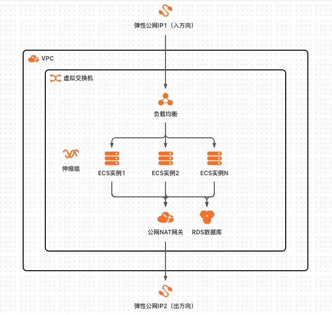

# Flask环境部署

## 概述

Node.js应用运行环境是在Alibaba Cloud Linux 3基础上在root账号下安装了nvm和node v20。支持选择ECS单机、弹性ECS集群等多种部署架构，集群均支持弹性伸缩。

## 前提条件

当您的账号是RAM账号时，需要对部分阿里云资源进行访问和创建操作。因此您的账号需要包含如下资源的权限。

| 权限策略名称                          | 备注                         |
  |---------------------------------|----------------------------|
| AliyunECSFullAccess             | 管理云服务器服务（ECS）的权限           |
| AliyunVPCFullAccess             | 管理专有网络（VPC）的权限             |
| AliyunROSFullAccess             | 管理资源编排服务（ROS）的权限           |
| AliyunComputeNestUserFullAccess | 管理计算巢服务（ComputeNest）的用户侧权限 |
| AliyunESSFullAccess             | 管理弹性伸缩服务（ESS）的权限           |
| AliyunRDSFullAccess             | 管理云数据库服务（RDS）的权限           |

## 部署架构

### ECS单机



### 弹性ECS集群


### 弹性Web后端环境


### 钉钉推荐架构



## 部署流程

单击[部署链接](https://computenest.console.aliyun.com/service/instance/create/cn-hangzhou?type=user&ServiceId=service-dfa5ff34a8f643368c33)
，按界面提示填写参数后创建服务实例。


## 结果验证

部署成功后，在root用户下部署了nvm和node.js v20.12.2版本，如果您想在其他用户下部署nvm和node.js，将install_nvm.sh复制到该用户目录下，使用该用户身份执行。


远程连接ECS后执行以下命令验证部署结果：

1. 查看已安装版本：

    ```shell
    nvm ls
    ```

2. 使用nvm安装其他node.js版本：

    ```shell
    nvm install 版本号
    ```

3. 切换node版本号：

    ```shell
    nvm use 版本号
    ```

4. 使用下面的命令测试node.js:

    ```shell
    nohup node /root/node_example.js &
    ```

    执行成功后访问 http://<公网IP地址> ，会返回 Hello World
